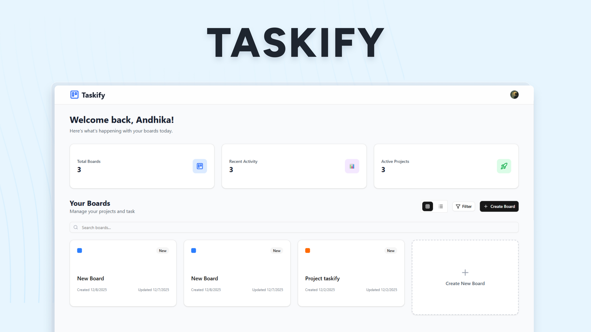

<h1 align="center"> Taskify </h1>




<p align="center">
  A modern Kanban-based task management application built to help individuals and teams organize tasks, track progress, and collaborate efficiently.
</p>


## Features

* **Kanban Board**: Intuitive drag & drop interface for managing tasks visually
* **Task Management**:

  * Create, update, and delete tasks
  * Task priorities (Low, Medium, High)
  * Due dates and assignees
* **Board Management**:

  * Multiple boards per user
  * Custom columns per board
  * Board color customization
* **Filtering & Search**:

  * Filter tasks by priority
  * Filter tasks by due date
  * Search boards from dashboard
* **Authentication & Security**:

  * Secure authentication with Clerk
  * User-isolated data using Supabase RLS
* **Pricing Plans**:

  * Free: 1 Board
  * Pro: Unlimited Boards
  * Enterprise: Extended features for teams

---

## Tech Stack

[](https://nextjs.org)
[](https://react.dev)
[](https://www.typescriptlang.org)
[](https://tailwindcss.com)
[](https://supabase.com)
[](https://clerk.com)

---

## Installation & Setup

### 1. Clone Repository

```bash
git clone https://github.com/yourusername/taskify.git
cd taskify
```

### 2. Install Dependencies

```bash
npm install
```

### 3. Environment Setup

```bash
cp .env.example .env.local
```

Update your environment variables:

```env
# Clerk
NEXT_PUBLIC_CLERK_PUBLISHABLE_KEY=
CLERK_SECRET_KEY=
NEXT_PUBLIC_CLERK_SIGN_IN_URL=/sign-in
NEXT_PUBLIC_CLERK_SIGN_UP_URL=/sign-up
NEXT_PUBLIC_CLERK_AFTER_SIGN_IN_URL=/dashboard
NEXT_PUBLIC_CLERK_AFTER_SIGN_UP_URL=/dashboard

# Supabase
NEXT_PUBLIC_SUPABASE_URL=
NEXT_PUBLIC_SUPABASE_ANON_KEY=
```

### 4. Start Application

```bash
npm run dev
```

Open [http://localhost:3000](http://localhost:3000)

---

## License

This project is licensed under the **MIT License**.

---

## Author

Made with ❤️ by **Andhika Putratama**

---

⭐ If this project helps you, consider giving it a star on GitHub.
